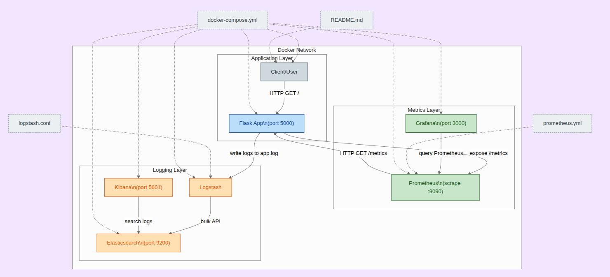

# Monitoramento e Logging com Docker, Prometheus, Grafana e ELK Stack

## Descrição

Este projeto demonstra como implementar um ambiente de monitoramento e centralização de logs para aplicações Flask utilizando Docker. Ele integra Prometheus e Grafana para monitoramento de métricas, além de Elasticsearch, Logstash e Kibana (ELK Stack) para coleta, processamento e visualização de logs.



## Tecnologias Utilizadas

- **Docker & Docker Compose**: Orquestração dos serviços.
- **Flask**: Aplicação web de exemplo.
- **Prometheus**: Coleta de métricas da aplicação.
- **Grafana**: Visualização de métricas.
- **Elasticsearch**: Armazenamento e busca de logs.
- **Logstash**: Processamento e envio de logs para o Elasticsearch.
- **Kibana**: Visualização e análise de logs.
- **prometheus-flask-exporter**: Exporta métricas do Flask para o Prometheus.

## Passo a Passo para Implementação

1. **Clone o repositório**
   ```sh
   git clone https://github.com/seu-usuario/monitoramento-e-logs-com-docker.git
   cd monitoramento-e-logs-com-docker
   ```

2. **(Opcional) Ajuste variáveis de ambiente**
   - Se necessário, edite arquivos de configuração para ajustar portas ou caminhos.

3. **Suba os containers**
   ```sh
   docker-compose up --build
   ```

4. **Acesse os serviços**
   - **Aplicação Flask:** [http://localhost:5000](http://localhost:5000)
   - **Prometheus:** [http://localhost:9090](http://localhost:9090)
   - **Grafana:** [http://localhost:3000](http://localhost:3000)
     - Login padrão: `admin` / `admin`
   - **Kibana:** [http://localhost:5601](http://localhost:5601)
   - **Elasticsearch:** [http://localhost:9200](http://localhost:9200)

5. **Configuração inicial**
   - No Grafana, adicione o Prometheus como data source (`http://prometheus:9090`).
   - Importe ou crie dashboards para visualizar métricas.
   - No Kibana, configure o índice de logs (`docker-logs`) para explorar os logs da aplicação.

6. **Testando**
   - Acesse a aplicação Flask e veja as métricas em Prometheus/Grafana.
   - Gere acessos e veja os logs sendo enviados para o Elasticsearch e visualizados no Kibana.

## Observações

- Os logs da aplicação Flask são gravados em `app.log` e processados pelo Logstash.
- O Prometheus coleta métricas expostas pelo Flask via `/metrics`.
- O projeto pode ser expandido para incluir alertas e dashboards personalizados.

---
